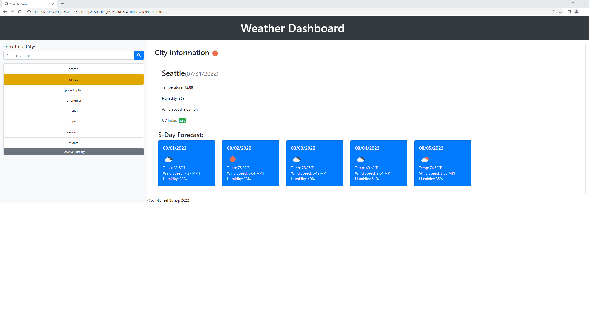

# Weather-Cast

## Server-Side APIs - Weather-Cast
The purpose of this application was to demonstrate the functionality of server-side api's to retrieve data stored on an external server's api. The application developed functions by allowing users to utilize the Openweather One Call API to retrieve weather data on searched cities. The data is then retrieved and displays Weather Condition, Wind, Temperature, Humidity and UV Index. The data is then stored locally. Additionally there will be functions to show a 5 day forecast as well as removing the search history. Unfortunately while I got the application to semi-work, I ran out of time. I do intend to finish the application this weekend in full.

## User Story

AS A traveler    
I WANT to see the weather outlook for multiple cities   
SO THAT I can plan a trip accordingly   

## Acceptance Criteria
GIVEN a weather dashboard with form inputs   
WHEN I search for a city   
THEN I am presented with current and future conditions for that city and that city is added to the search history   
WHEN I view current weather conditions for that city   
THEN I am presented with the city name, the date, an icon representation of weather conditions, the temperature, the humidity, the wind speed, and the UV index   
WHEN I view the UV index   
THEN I am presented with a color that indicates whether the conditions are favorable, moderate, or severe   
WHEN I view future weather conditions for that city   
THEN I am presented with a 5-day forecast that displays the date, an icon representation of weather conditions, the temperature, the wind speed, and the humidity   
WHEN I click on a city in the search history   
THEN I am again presented with current and future conditions for that city   

## Application's Utilities
- HTML
- CSS
- JavaScript
- JQuery
- Bootstrap
- Moment.JS
- Openweather One Call API

## Screenshots

## URL link for deployed application
URL for weather dashboard: https://theothermike5544.github.io/Weather-Cast/